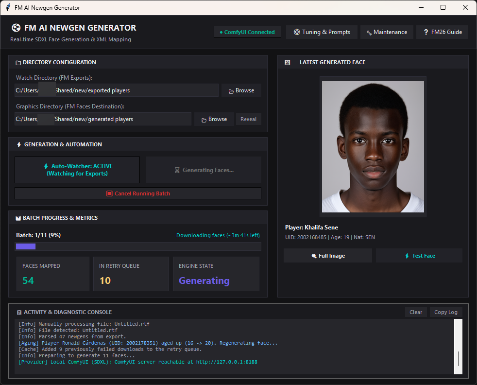
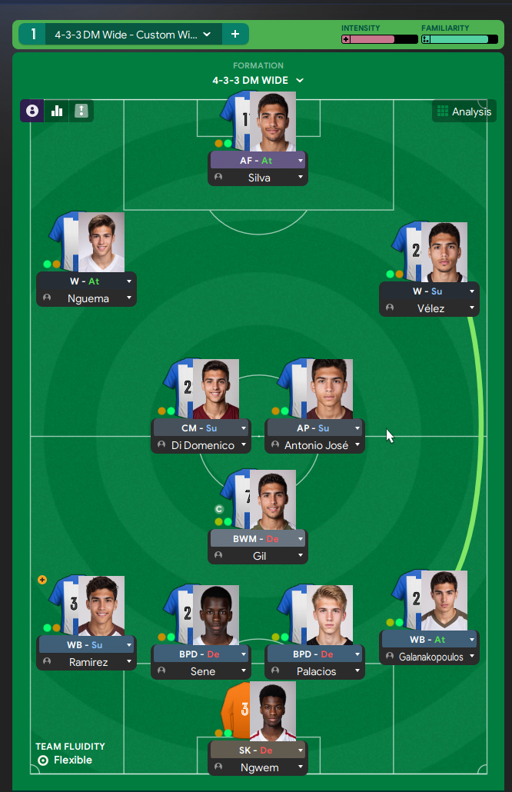

# Football Manager AI Newgen Face Generator

Automatically generates photorealistic, unlimited AI portraits for your **Football Manager 2024** and **Football Manager 2026** youth academy players (newgens/regens) — or any player without a face — free, offline, on your own GPU.

> **Most users:** download `FMNewgenGenerator.exe` from the [official site](https://fm-face-generator.netlify.app). The first run auto-installs a local AI engine (ComfyUI) plus the RealVisXL realism model and sets everything up for you.
>
> - Windows 10 / 11 · **NVIDIA GPU** with 4 GB VRAM minimum (6–8 GB recommended) · 8 GB RAM minimum (16 GB recommended)
> - ~25 GB free disk (engine ~2 GB + model ~7 GB, one-time install)
> - **FM26 players:** FM26 removed the text export → the free **FM26 Player Export** plugin (fmscout) is supported — see Quick Start step 3.

| Provider | Cost | Quality | Requirements |
|----------|------|---------|--------------|
| **Local ComfyUI (SDXL)** ⭐ | Free, unlimited, offline | Excellent & fully offline | NVIDIA GPU with 6–8 GB VRAM, ~25 GB free disk |

The app watches your player-search exports, builds a unique prompt per player (age, nationality, personality), renders each face on your GPU, and writes the game-ready `config.xml` mapping automatically.

---

## Screenshots

| App (Generating Batch) | Result in FM (Tactics Lineup) |
|---|---|
|  |  |

---

## ⚡ Quick Start

### 1. Install (Windows, recommended)
1. Download **`FMNewgenGenerator.exe`** from the [site](https://fm-face-generator.netlify.app) and run it.
2. The **Setup** checks your system, downloads the AI engine + model (resumable, with a progress bar), and installs them under `%LOCALAPPDATA%\FM Newgen Generator\` or a file path from your choosing.
3. It writes a ready-to-use `config.json` beside the EXE, then launches the app. On later runs it **auto-starts** the embedded ComfyUI server for you — watch the status badge turn **green (Connected)**.

### 2. FM preferences (mandatory, once)
For FM to show the generated faces:
1. **Preferences → Interface**
2. **Untick** *"Use caching to decrease page loading times"*
3. **Tick** *"Reload skin when confirming changes in Preferences"*
4. **Clear Cache**, then **Reload Skin**.

### 3. Export your newgens

**FM24** — free export filter:
1. Download the included export filter: **`fm_newgen_export_filter.fmf`** from the [site download page](https://fm-face-generator.netlify.app).
2. Copy it to `Documents\Sports Interactive\Football Manager 2024\filters\`.
3. In FM: **Scouting → Player Search**, apply the filter (make sure the view shows the **ID** column — newgen UIDs start with `2`).
4. **Ctrl + A** (select all) → **Ctrl + P** → **To text file** → save into your configured **Watch Directory**.

**FM26** — FM removed the text export, so use the free third-party plugin **FM26 Player Export** by vinteset (BepInEx):
1. Install [BepInEx 6 (IL2CPP)](https://docs.bepinex.dev/) for FM26 and copy the plugin's `FM26PlayerExport.dll` into `BepInEx\plugins\FM26PlayerExport\`.
2. In FM, make sure the **ID** column is visible in your player view.
3. Press **F9** to export — the app reads its CSV/HTML exactly like an FM24 export.
4. In the app, use **FM26 Setup… → Set Watch Directory to plugin output** so it watches the plugin's export folder (or your FM26 Documents folder).
   - The plugin shows as “unverified”/“unknown publisher” DLL; right-click → **Properties → Unblock**, and add the plugin folder to antivirus exceptions if needed. Use the [plugin's official page](https://www.fmscout.com/a-fm26-player-csv-export.html) as the source of truth.

### 4. Generate
In the app: set **Watch Directory** and **Graphics Directory**, press **Start Watcher**, then export in FM. The app parses the list, generates a face for every new UID, updates `config.xml`, and (optionally) reloads the skin for you.

---

## ✨ Key Features

- **Unlimited offline generation** — local SDXL, no quotas, no API keys, no cloud.
- **FM24 & FM26** — reads `Ctrl+P → To text file` exports on FM24 and the FM26 Player Export plugin's CSV/HTML (auto-detects `;`/`,`/`|`/tab delimiters and UTF-8/Latin-1 encodings).
- **Milestone-based aging** — each UID seeds the face, so players keep the same bone structure while hair, stubble and mature features update at ages **16, 20, 24, 28 ...**.
- **Personality-aware prompts** — Model Citizen ≈ clean-cut; Temperamental ≈ stern; Jovial ≈ warm smile, etc.
- **Weighted demographics** — multi-ethnic nations (France, England, Brazil…) roll realistic academy ratios.
- **Real-player safe** — faces go to their own folder + `config.xml`; existing facepacks are untouched.
- **Cancel & resume batches** — a running batch can be stopped; finished faces are kept and the rest are queued for the next run (plus a live ETA on the progress bar).
- **Generate Test Face** — renders one sample face with your current face style so you can preview prompt edits before generating a whole batch.
- **Log file** — every console message is also appended to `app.log` next to `config.json` for easier debugging.

## 🎨 Customizing the look (Edit Face Style…)

The **Edit Face Style…** button in the app opens a raw prompt editor:

- **Positive prompt** — the description of every photo. `[AGE]`, `[NATIONALITY]` and `[PERSONALITY]` are filled in per player. The default is a clean media-day headshot: plain white studio background, unbranded shirt, 85mm/f4 look.
- **Negative prompt** — things to avoid (grass/pitch scenery, logos/badges, crossed arms, waxy “AI” skin, etc.).
- **Reset to Defaults** restores the shipped prompts; changes save to `config.json`.

> Players under 20 are automatically described as teenagers with smooth features — no need to add that yourself.

---

## 🩺 Troubleshooting

| Symptom | Fix |
|---|---|
| **“ComfyUI not connected” / status badge stays red** | Wait up to a minute for auto-start (first boot loads the model). Click **Test Connection**. If it still fails, run **Maintenance → Repair** — it re-downloads missing/corrupt pieces. |
| **Model list empty / checkpoint not found** | The model must live in the **nested** folder `ComfyUI\ComfyUI\models\checkpoints\` (portable installs are nested). Repair also migrates a misplaced model automatically. |
| **Faces generated but not showing in FM** | Caching must be off (Quick Start step 2). **Clear Cache → Reload Skin**. Confirm the graphics folder in the app matches where your skin looks. |
| **Nothing is generated after exporting** | The export must include the **ID** column (UIDs starting with `2`) and be saved into the app's **Watch Directory**. |
| **FM26 plugin export is empty / shows “Col1, Col2…”** | Press **F8** in the plugin to re-scan the current screen, then **F9**. Stay on the Squad or Player Search screen and keep the **ID** column visible. |
| **FM26 plugin/DLL removed by antivirus** | Normal — it's an unsigned third-party DLL. Right-click → Properties → Unblock, and add `BepInEx\plugins\FM26PlayerExport` to your antivirus exceptions. |
| **Generation is very slow** | Less than 6–8 GB VRAM falls back to CPU. Lower the concurrency limit (and steps) in **Generation Settings**. |
| **First-run download fails / stalls** | The wizard resumes partial downloads automatically. Check ~25 GB free disk space and retry. |
| **SmartScreen / antivirus warning** | The EXE is unsigned. Click **More info → Run anyway** — the tool is open source; see *For developers* below. |

---

## 📅 How Automatic Aging Works

Every export stores each player's generation age in `metadata.json`. When a player crosses a milestone (**20, 24, 28**), the app regenerates their face using the UID as the visual seed — same facial structure, updated styling, hair and maturity. You only need to export your list once in a while.

---

## License & Credits

Free fan tool — **not affiliated with Sports Interactive**. The bundled RealVisXL model is distributed under the [CreativeML Open RAIL++-M](https://huggingface.co/SG161222/RealVisXL_V5.0/blob/main/LICENSE.md) license.
