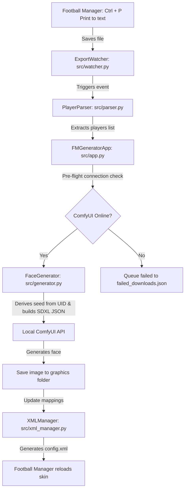

# FM AI Newgen Generator — Developer & AI Agent Guide

This document serves as a complete technical guide and architectural blueprint for the Football Manager AI Newgen Generator project. It details each phase of the application pipeline, making it easy for any developer (human or AI agent) to understand, maintain, or extend the codebase.

---

## 🏗️ System Overview & Pipeline
The application runs as a Python Tkinter desktop GUI that coordinates a background file-watching thread and an asynchronous generation loop. The core flow operates as follows:

---

## 📁 Core Codebase Layout
*   `src/app.py`: The main coordinator. Manages configuration loading, threads, GUI startup, and connects the watcher events to the generator loops.
*   `src/ui.py`: The Tkinter GUI implementation. Fully styled with dark-themed panels, logging scrolls, statistical trackers, and setting controls.
*   `src/watcher.py`: File monitoring wrapper that alerts the system when new exports are dropped.
*   `src/parser.py`: The RTF/HTML data scraper and prompt-building engine.
*   `src/generator.py`: Connects to ComfyUI, sends SDXL payloads, polls tasks, and downloads PNG outputs.
*   `src/xml_manager.py`: Regex-based parser and string-writer for Football Manager's strict graphics `config.xml` structure.
*   `run_all.bat`: One-click startup script that launches both the ComfyUI server and the Generator App.

---

## 🛠️ Step-by-Step Pipeline Breakdown

### Phase 1: File Monitoring (`src/watcher.py`)
*   **Purpose:** Monitors the designated `watch_directory` (usually `/exports`) for new text/HTML files exported from the game.
*   **Mechanism:** Implements `watchdog.observers.Observer` to capture `on_created` events.
*   **Rules:**
    1.  Ignores directories.
    2.  Filters only for files with `.txt` or `.html` extensions.
    3.  Debounces events: When a print file is created, FM writes it in chunks. The watcher waits until the file is fully written and unlocked before alerting the parser.

### Phase 2: Data Scraping & Demographics (`src/parser.py`)
*   **Purpose:** Extracts UIDs, ages, nationalities, and personalities from raw RTF/HTML data.
*   **Mechanism:**
    1.  Uses `striprtf` to strip out styling syntax if the file is an RTF format.
    2.  Uses regular expressions to find column indexes matching headers (`ID`, `Age`, `Nat`, `Personality`).
    3.  Iterates through rows and filters for UIDs starting with `2` (the standard prefix for generated players).
*   **Demographic Presley Mapping:**
    To represent realistic ethnic diversity in multi-ethnic nations (like France, USA, Belgium, Brazil), the system uses a weighted lookup map (`DEMOGRAPHIC_WEIGHTS` and `REGIONAL_PRESETS`):
    *   For French players, the system rolls a random choice: 70% Western Europe preset (fair skin, light eyes), 20% African preset (dark skin, dark hair), 10% North African preset (olive skin, dark hair).
    *   This ensures the generated faces naturally reflect the demographic makeup of each country's real-life academies.

### Phase 3: Zoomed-Out Dynamic Prompt Building (`src/parser.py`)
*   **Purpose:** Builds descriptive prompt strings optimized for local SDXL models, adjusting framing and style.
*   **Zoom/Framing Tweaks:**
    To prevent player heads from appearing too large in the game's UI (which can cover kit numbers), the template forces a **bust shot** (head and shoulders):
    `"candid smartphone camera snapshot medium shot bust portrait of a [AGE]-year-old male [NATIONALITY] football player, [PERSONALITY], head and shoulders, showing upper chest, athletic training shirt, natural lighting..."`
*   **Age Milestones:**
    *   *Clean-shaven teenagers (under 20):* The prompts swap `"male"` to `"teenage male"`, `"football player"` to `"youth academy soccer player"`, and append `"soft youthful facial features, smooth skin"` to guarantee realistic youth portraits.
    *   *Milestone 20:* High beard/stubble density for South American and Middle Eastern players.
    *   *Milestone 24 & 28:* Beards and mature styles become fully developed.

### Phase 4: Local ComfyUI API Execution (`src/generator.py`)
*   **Purpose:** Dispatches text prompts to a local ComfyUI instance running on `http://127.0.0.1:8188`.
*   **Mechanism:**
    1.  **Pre-flight Ping:** Connects to `/system_stats` to verify ComfyUI is running. If not, saves players to `failed_downloads.json` and skips generation.
    2.  **Auto-checkpoint Loading:** If `comfyui_model` is blank, queries `/object_info/CheckpointLoaderSimple` to auto-resolve to the first model in the user's checkpoints folder.
    3.  **Workflow Construction:** Generates an SDXL JSON payload using a standard single-image setup (KSampler, CheckpointLoader, EmptyLatentImage, SaveImage).
    4.  **Async Queueing:** Posts payload to `/prompt` and extracts the `prompt_id`.
    5.  **History Polling:** Queries `/history/{prompt_id}` every 2 seconds until the job completes.
    6.  **Download:** Fetches the generated file from `/view?filename=...` and saves it as `[UID].png`.

### Phase 5: XML Graphics Bind (`src/xml_manager.py`)
*   **Purpose:** Links the saved `.png` filenames to Football Manager's virtual graphics indexing database.
*   **XML Rules:**
    1.  The mapping must be written with the mandatory `r-` prefix inside the `to` target:
        `<record from="[FILENAME]" to="graphics/pictures/person/r-[UID]/portrait"/>`
    2.  The output must contain standard lowercase tags (`record`, `list`, `boolean`) and comment separators (`<!-- picture mappings -->`) to match game expectations.
    3.  Uses a regex parser to read existing `config.xml` files, preventing XML structure failures or parser crashes from throwing away existing facepacks.

---

## 🕹️ Instructions for Running & Testing

1.  **Setup Checkpoints:**
    Ensure your SDXL model is placed in the inner folder:
    `ComfyUI\ComfyUI\models\checkpoints\Juggernaut-XL_v9_RunDiffusionPhoto_v2.safetensors`
2.  **Sync Local Config:**
    Rename `config.example.json` to `config.json`.
3.  **Launch Launcher:**
    Double-click `run_all.bat`. It will start ComfyUI automatically and launch the GUI.
4.  **In-Game Reload Preferences:**
    Open Football Manager preferences, **disable image caching**, and click **Clear Cache** followed by **Reload Skin**.
